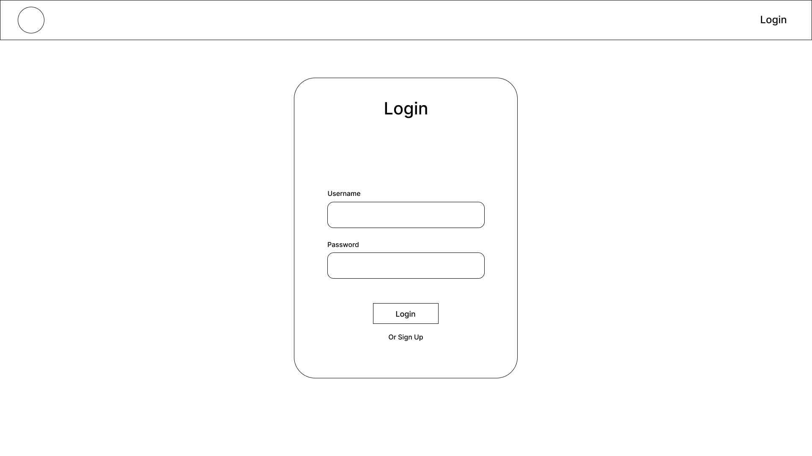
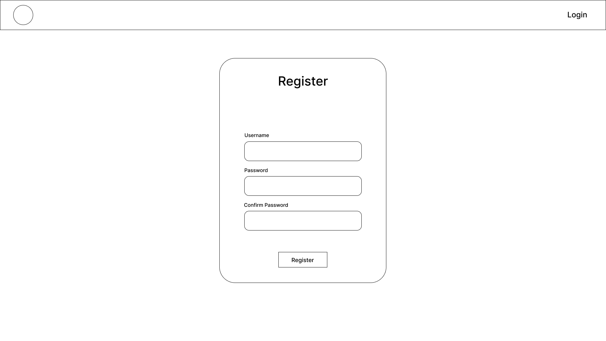
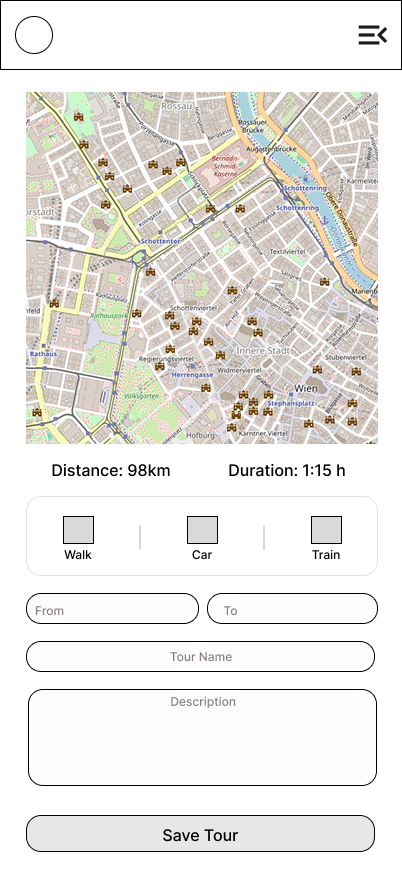

    # TourPlanner - Intermediate Hand In
[Github Link](https://github.com/meoryn/Tour-Planner)
## Seiten / Routes

### Home
Startseite mit Begrüßungstext

### Tour List (/tourlist)

Zeigt die Touren des eingeloggten Nutzers als Liste an.
Bietet eine Full-Text-Search über den Titel bzw. die Beschreibung der Tour. Jede Tour lässt sich einzeln exportieren, wahlweise lassen sich auch alle Touren mit einem Button exportieren. Per File-Upload können die exportierten JSON-Tour Dateien auch wieder hochgeladen werden. Für jede Tour wird eine Tour-Card Komponente erstellt

### Add Tour (/tour/add)
Formular zum Erstellen einer neuen Tour. Besteht aus einem Platzhalter für die Map und der TourSideBar-Komponente, in der eine neue Tour erstellt werden kann. 

### Edit Tour (/tour/:id/edit)
Gleicher Aufbau wie Add Tour, nur im Modus "Edit". Die ID aus der URL wird genutzt, um die bestehende Tour aus dem `TourStateService` zu laden und vorzubefüllen. Verwendet ebenfalls die `TourSidebar`-Komponente.

### Login (/login)
Login-Seite mit Email- und Passwortfeld. Aktuell noch nicht aktiv, da das passende Backend noch nicht vorhanden ist. Beieinhaltet einen Link zur Registrierungsseite.

### Register (/register)
Registrierungsseite. Ebenfalls schon vorhanden, aber noch nicht integriert. Kommuniziert mit dem dazugehörigen UserStateService.

---

## State Management

### TourStateService

Zentraler Service für alle Tour-Daten. Verwaltet:
- Liste aller Touren (als Signal)
- Aktuelle Suchquery (via Computed())
- Ausgewählte Tour
- Tour Logs der ausgewählten Tour
- CRUD-Operationen für Touren und Logs
- Export/Import von Touren als JSON

Die Beispieltouren sind derzeit noch hardcoded.

### UserStateService

Noch nicht vollständig integriert, da die Backend-Anbindung noch fehlt. Verwaltet den aktuell eingeloggten User, und hat Methoden für register, Login und Account Löschen. 

##  Komponenten

### `TourCard`

Zeigt die Details einer Tour an. Enthält alle Properties der Tour. Durch einen Klick gelangt man zur Edit-Tour Seite.

### `TourSidebar`
Komponente, in der Touren erstellt und bearbeitet werden. Nimmt "Add" oder "Edit" als Input.Bei Edit wird die aktuelle Tour als Input übergeben.

### `TourLogsDialog`
Modal, der die Logs der ausgewählten Tour anzeigt. Zeigt Datum, Distanz, Zeit, Rating und Schwierigkeitpro Log. Auf der rechten Seite des Dialogs ist ein Formular zum Hinzufügen/Bearbeiten von Logs.

### Wireframes
Beim Aufbau der Seiten und Komponenten wurde auf die vorher erstellten Wireframes zurückgegriffen.

#### Login

#### Register

#### Landing Page

#### Tour Overview

#### Create Tour

#### Edit Tour

#### Mobile

