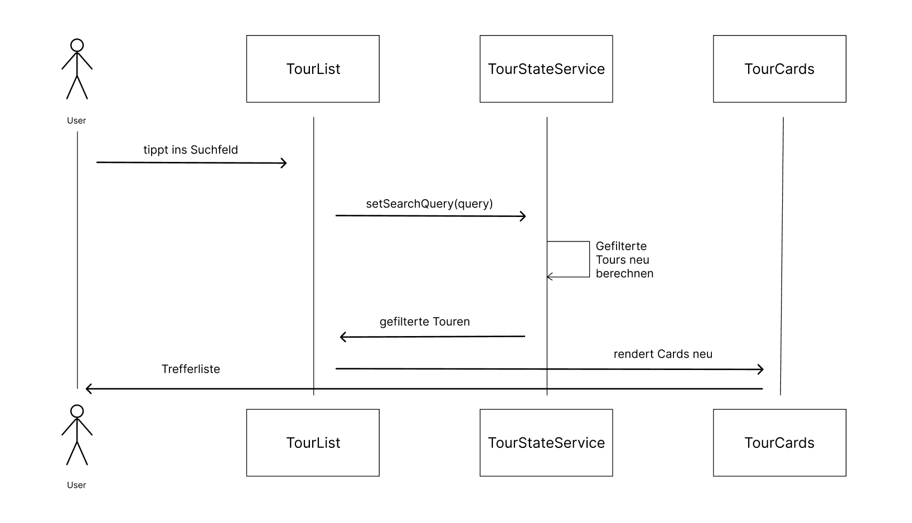
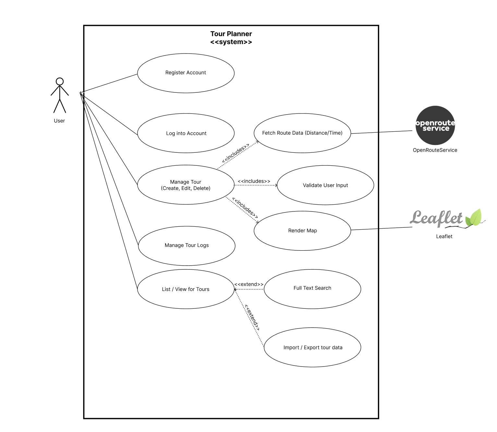

# Tour-Planner finale Abgabe
[Github Link](https://github.com/meoryn/Tour-Planner)

## Setup

### 1. `.env` anlegen
Als erstes muss eine .env datei im backend Ordner angelegt & ausgefüllt werden, als Vorlage dient die .env.example.

### 2. Datenbank starten
Die PostgreSQL-Datenbank läuft über Docker Compose und zieht die Zugangsdaten aus der `.env`:

```
cd backend
docker compose up -d
```

### 3. Backend starten

```
cd backend
mvn spring-boot:run
```
Das Backend läuft anschließend auf `http://localhost:8080`.

### 4. Frontend starten
```
cd frontend
npm npm i
ng serve
```
Die Angular-App ist danach unter `http://localhost:4200` erreichbar.

### Tests ausführen
```bash
cd backend  && mvn test  
cd frontend && ng test       
```

## Seiten / Routes

### Home
Startseite mit Begrüßungstext

### Tour List (/tourlist)

Zeigt die Touren des eingeloggten Nutzers als Liste an.
Bietet eine Full-Text-Search der Tour. Jede Tour lässt sich einzeln exportieren, wahlweise lassen sich auch alle Touren mit einem Button exportieren. Per File-Upload können die exportierten JSON-Tour Dateien auch wieder hochgeladen werden. Für jede Tour wird eine Tour-Card Komponente erstellt

### Add Tour (/tour/add)
Formular zum Erstellen einer neuen Tour. Besteht aus einem Platzhalter für die Map und der TourSideBar-Komponente, in der eine neue Tour erstellt werden kann. 

### Edit Tour (/tour/:id/edit)
Gleicher Aufbau wie Add Tour, nur im Modus "Edit". Die ID aus der URL wird genutzt, um die bestehende Tour aus dem TourStateService zu laden und vorzubefüllen. Verwendet ebenfalls die TourSidebar-Komponente.

### Login (/login)
Login-Seite mit Email- und Passwortfeld. Beieinhaltet einen Link zur Registrierungsseite.

### Register (/register)
Registrierungsseite mit Passwort-Bestätigung. Registriert den Benutzer über das Backend (/auth/register) und meldet ihn direkt an. Beinhaltet einen Link zur Login-Seite.

---

## Überblick

Die Anwendung ist ein klassisches Client-Server-System:

Angular SPA (Browser)  ⇄  HTTP/JSON  ⇄  Spring Boot REST-API  ⇄  JPA/Hibernate  ⇄  PostgreSQL
                                              │
                                              └── REST ──► api.openrouteservice.org (Directions & Geocoding)

- Das **Frontend** (`frontend/`) ist eine Angular-21-Single-Page-Application mit Standalone-Komponenten. Es kommuniziert ausschließlich über HTTP mit JSON-Payloads mit dem Backend.

- Das **Backend** (`backend/`) ist eine Spring-Boot-4-Anwendung (Java 25, Maven), die eine REST-API auf Port 8080 bereitstellt. Die Persistenz läuft über Spring Data JPA (Hibernate) in PostgreSQL; Routing- und Geocoding-Anfragen werden an OpenRouteService weitergeleitet.

- Die **Datenbank** läuft in Docker über `backend/compose.yaml` (PostgreSQL, Datenbank `tourplanner`).


## State Management

### TourStateService

Zentraler Service für alle Tour-Daten. Verwaltet:
- Liste aller Touren (als Signal)
- Aktuelle Suchquery (via Computed())
- Ausgewählte Tour
- Tour Logs der ausgewählten Tour
- CRUD-Operationen für Touren und Logs
- Export/Import von Touren als JSON

### UserStateService

Verwaltet den aktuell eingeloggten User (Username + JWT) als Signal. Die Session wird in localStorage gespeichert und beim App-Start wiederhergestellt. Bietet isAuthenticated(), getToken(), setSession() und logout() — darauf greifen der Auth-Guard und der HTTP-Interceptor zu.


##  Komponenten

### TourCard

Zeigt die Details einer Tour an. Enthält alle Properties der Tour. Durch einen Klick gelangt man zur Edit-Tour Seite.

### TourSidebar
Komponente, in der Touren erstellt und bearbeitet werden. Nimmt "Add" oder "Edit" als Input.Bei Edit wird die aktuelle Tour als Input übergeben.

### TourLogsDialog
Modal, der die Logs der ausgewählten Tour anzeigt. Zeigt Datum, Distanz, Zeit, Rating und Schwierigkeitpro Log. Auf der rechten Seite des Dialogs ist ein Formular zum Hinzufügen/Bearbeiten von Logs.

## Frontend-Architektur (MVVM)

Das Frontend ist nach dem MVVM-Pattern aufgebaut:

- **View**: die Komponenten-Templates (die .html-Dateien). Sie binden nur an Properties und lösen Events aus, z.B. tour-list.html oder tour-sidebar.html.
- **ViewModel**: die Komponentenklassen zusammen mit den State-Services. Die Komponenten stellen Signals und Computed-Werte bereit, an die das Template bindet. Die State-Services (TourStateService, UserStateService, RouteStateService, MapPickService) halten den gemeinsamen Zustand als Signals und geben ihn nach außen read-only weiter.
- **Model**: die TypeScript-Models in models/ (Tour, TourLog, Location, Enums) und die API-Services (TourApiService, AuthApiService), die sie auf das JSON des Backends abbilden.

## Backend

Das Backend folgt einer layered Architecture:


| Schicht | Klassen | Verantwortung |
|---|---|---|
| Presentation | `TourController`, `TourLogController`, `AuthController`, `DirectionHandler`, `GeocodeHandler`, `GlobalExceptionHandler` | REST-Endpunkte, Request-/Response-DTOs, HTTP-Statuscodes, zentrales Exception-Mapping |
| Business-Logik | `TourService`, `TourLogService`, `AuthService`, `UserService`, `JwtService`, `OpenRouteService`, `TourUserDetailsService` | Validierung, Ownership-Prüfungen, Token-Handling, externe API-Aufrufe, Transaktionen |
| Data Access | `TourRepository`, `TourLogRepository`, `UserRepository` | Datenbankzugriff über Spring Data JPA (`JpaRepository`) mit abgeleiteten Queries wie `findAllByUserId` |
| Modell | Entities (`Tour`, `TourLog`, `User`, `Location`), DTOs, OpenRouteService-Response-Records | JPA-Entities und Transferobjekte |
| Security | `SecurityConfig`, `JwtAuthenticationFilter`, `UserPrincipal` | Zustandslose JWT-Authentifizierung, CORS, Endpunkt-Autorisierung |

### REST-Endpoints

| Methode | Endpunkt | Zweck |
|---|---|---|
| POST | `/auth/register` | Neuen Benutzer registrieren, liefert ein JWT |
| POST | `/auth/login` | Login, liefert ein JWT |
| GET / POST | `/tours` | Touren des eingeloggten Benutzers auflisten / erstellen |
| PUT / DELETE | `/tours/{id}` | Tour aktualisieren / löschen (Ownership wird geprüft) |
| GET / POST | `/tour-logs` | Logs einer Tour auflisten / Log erstellen |
| PUT / DELETE | `/tour-logs/{id}` | Tour-Log aktualisieren / löschen |
| POST | `/directions` | Routenberechnung über OpenRouteService |
| GET | `/geocode` | Adresssuche (Autocomplete) über OpenRouteService |

Die Controller sprechen nur DTOs, das Mapping zwischen Entity und DTO übernimmt die Utility-Klasse TourUtils.

### Datenbank
Als Datenbank kommt PostgreSQL (via docker-compose) zum Einsatz. Eine Tour gehört zu einem User und hat mehrere Tour-Logs. Der Start- und Zielort werden als eingebettete Location direkt in der Tour gespeichert.

### Security
Authentifizierung läuft stateless über JWT. Passwörter werden mit BCrypt gehasht. Ein JwtAuthenticationFilter prüft bei jedem geschützten Request das Bearer-Token und setzt den User in den SecurityContext. Nur die /auth-Endpunkte sind offen, alles andere (inkl. /directions) ist geschützt. Im Frontend hängt ein HTTP-Interceptor das Token an die Requests an und leitet bei einem 401 automatisch zum Login um.

### Autorisierung
In der Service-Schicht wird geprüft, ob der eingeloggte User auch der Besitzer der Tour bzw. des Logs ist. Fremde Datensätze können so nicht verändert oder gelöscht werden (Antwort: 403 Forbidden).

### Fehlerbehandlung & Logging
Ein globaler GlobalExceptionHandler mappt die Exceptions auf passende HTTP-Statuscodes (404, 403, 409, 400, 502, 500). Fehler des OpenRouteService werden abgefangen und als 502 zurückgegeben. Geloggt wird durchgehend mit Log4j2 (statt dem Standard-Logback).

### Konfiguration
Es liegen keine Secrets im Code. Der JWT-Secret-Key, der OpenRouteService-API-Key und die Datenbank-Zugangsdaten (DB_USERNAME/DB_PASSWORD) werden über Umgebungsvariablen aus einer git-ignorierten .env-Datei geladen, in der application.properties stehen nur Platzhalter. Dieselbe .env verwendet auch docker-compose für den PostgreSQL-Container. Als Vorlage für neue Umgebungen ist eine .env.example ohne echte Werte eingecheckt.

## Berechnete Attribute

Zwei Tour-Attribute werden nicht gespeichert, sondern im Frontend aus den Tour-Daten abgeleitet (models/tour.ts) und auf jeder Tour-Card angezeigt:

- **Popularität** (tourPopularity): die Anzahl der Tour-Logs einer Tour — je öfter eine Tour absolviert und dokumentiert wurde, desto populärer ist sie.
- **Kinderfreundlichkeit** (isTourChildFriendly): eine Tour gilt als kinderfreundlich, wenn sie mindestens ein Log hat, alle erfassten Schwierigkeiten Easy sind, die Dauer unter 100 Minuten und die Distanz unter 100 km liegt.

Da beides reine Funktionen über die Tour-Daten sind, werden die Werte über Signals automatisch neu berechnet, sobald sich ein Log ändert.

## Full-Text-Search

Die Suche läuft komplett im Frontend, da die Touren des Nutzers  bereits im TourStateService liegen. Über ein Computed-Signal (filteredTours) wird die Liste bei jeder Änderung der Suchquery neu gefiltert. Durchsucht werden Titel, Beschreibung und die Kommentare aller Tour-Logs — und zusätzlich die berechneten Werte: eine Zahl (z.B. "2") findet Touren mit genau dieser Log-Anzahl (Popularität), Eingaben wie "child" oder "child-friendly" finden alle kinderfreundlichen Touren.

Ablauf: Der Nutzer tippt ins Suchfeld → die Tour-List ruft setSearchQuery() auf → das searchQuery-Signal ändert sich → das filteredTours-Computed rechnet neu → die Liste der Tour-Cards wird neu gerendert.

### Sequenzdiagramm



## Entscheidungen

- **Angular Signals** werden durchgehend für das State Management verwendet (bis auf gewisse PrimeNG Components).
- **Leaflet** wird erst nach dem Rendern initialisiert, damit es mit dem Server-Side-Rendering von Angular zusammenspielt. Die gesamte Kartenlogik liegt in einer MapFacade.
- **OpenRouteService**: Die Routen werden über das Backend berechnet.
- **Export/Import**: Beim Import werden die Touren nacheinander ans Backend geschickt, damit die IDs sauber vergeben werden.

### Fehlschläge und Korrekturen

Dinge, die nicht beim ersten Versuch funktioniert haben:

- *Der Tour-Import* wurde im April gebaut, dann wieder entfernt, weil er die Tour-Liste beschädigte, und erst nach der Leaflet-Integration repariert wieder eingebaut. Die finale Version validiert das geparste JSON und importiert Touren sequenziell, damit ein fehlerhafter Eintrag nicht die ganze Liste korrumpiert.
- *Dark Mode* wurde deaktiviert, weil sich PrimeNG- und Tailwind-Styles im Dark Mode in die Quere kamen und den Aufwand zum beheben nicht wert war
- *Die Auth-Logik lag zuerst im Controller* und wurde in einen eigenen AuthService ausgelagert, da Controller für die Funktion der Authentication nicht gedacht sind.
- *OpenRouteService-Fehler blieben anfangs unbehandelt*, wenn die externe API Fehler zurückgab, da wir zuerst die Funktionalität grundsätzlich testen wollten. Eine eigene RouteServiceException inklusive Behandlung im GlobalExceptionHandler wurde im nachhinein eingebaut.
- */directions war zunächst öffentlich* erreichbar und das Frontend hat den Token weggelassen. Beim Testen fiel auf, dass der Endpunkt nicht im Auth inkludiert ist und wurde dementsprechend hinzugefügt.
- *Der Geocoding-API-Key lag im Frontend* Da der Quellcode abgegeben wird, wäre der Key öffentlich gewesen. Die Adresssuche wurde deshalb wie die Routenberechnung über einen Backend-Endpunkt (/geocode) geführt; der Key liegt jetzt nur noch in der serverseitigen .env.
- *Ein Unit-Test deckte eine Inkonsistenz in der Kinderfreundlichkeit auf:* Eine Tour ohne Logs (logs: undefined) galt als nicht kinderfreundlich, eine Tour mit leerem Log-Array (logs: []) aber als kinderfreundlich. Der neue Suchtest ist genau darüber gestolpert; die Funktion behandelt jetzt beide Fälle gleich (keine Logs → nicht kinderfreundlich).

## Design Patterns

- **Facade**: MapFacade kapselt die gesamte Leaflet-Logik (Karten-Setup, Tile-Layer, Route zeichnen, Klick-Events), sodass die Komponenten Leaflet nie direkt ansprechen.
- **Repository**: TourRepository, TourLogRepository und UserRepository abstrahieren den Datenbankzugriff über Spring Data JPA.
- **DTO**: eigene Request- und Response-DTOs entkoppeln die REST-Schnittstelle von den JPA-Entities.
- **Mapper**: TourUtils und LocationUtils übernehmen das Mapping zwischen DTOs und Entities.
- **Chain of Responsibility**: der JwtAuthenticationFilter in der Spring-Security-Filterkette und der HTTP-Interceptor in Angular reichen den Request jeweils weiter, nachdem sie ihren Teil erledigt haben (Token prüfen bzw. anhängen).
- **Observer**: Angular Signals und RxJS-Observables sorgen dafür, dass die Views automatisch auf Zustandsänderungen reagieren.
- **Singleton**: Spring-Beans und Angular-Services mit providedIn: 'root' existieren jeweils nur einmal.

## Unit Tests

Insgesamt gibt es 48 automatisierte Tests: 28 im Backend (JUnit 5 + Mockito, `./mvnw test`) und 20 im Frontend (Vitest, `npm test`). Die Backend-Tests laufen gegen eine H2-In-Memory-Datenbank (eigene application.properties unter src/test/resources), sie brauchen also weder ein laufendes PostgreSQL noch eine .env.

**Backend – TourServiceTest** (JUnit + Mockito): testet den TourService. Unter anderem wird Autorisierung getestet: dass ein User fremde Touren nicht bearbeiten oder löschen kann und dass dabei das Repository nicht verändert wird. Zusätzlich werden das Not-Found-Verhalten und das CRUD inklusive Entity↔DTO-Mapping getestet. Repository und UserService werden dabei gemockt.

**Backend – TourLogServiceTest**: dieselbe Systematik für Tour-Logs: Mapping, Erstellen mit Tour- und User-Referenz, Update und Delete nur durch den Besitzer, Not-Found-Verhalten bei fehlenden Logs. Die Ownership-Prüfungen sind sicherheitsrelevant — ein Fehler hier würde bedeuten, dass User fremde Daten verändern können.

**Backend – AuthServiceTest**: die Registrierung wird bei vergebenem Benutzernamen abgelehnt (ohne etwas zu speichern), Passwörter werden vor dem Speichern encodiert (nie im Klartext persistiert), der Login liefert ein Token und schlägt bei falschen Credentials fehl, ohne ein Token zu erzeugen. Fehler in diesem Code wären direkt sicherheitskritisch.

**Backend – JwtServiceTest**: ein erzeugtes Token validiert, der Username-Claim wird korrekt extrahiert; abgelehnt werden kaputte, abgelaufene und mit falschem Key signierte Tokens. Der JwtService ist das Fundament der gesamten Zugriffskontrolle — jede dieser Ablehnungen muss zuverlässig funktionieren.

**Backend – BackendApplicationTests**: bootet den kompletten Spring-Context und fängt damit fehlkonfigurierte Beans, kaputte JPA-Mappings und ungültige Security-Konfiguration in einem Schlag — genau die Fehlerklasse, die sonst erst beim Deployment auffällt.

**Frontend – tour-card.spec.ts**: testet die reinen Funktionen tourPopularity und isTourChildFriendly. Das sind fachliche Regeln, die dem Nutzer angezeigt werden. Getestet werden gezielt die Grenzfälle (keine Logs, ein nicht-einfaches Log, Dauer/Distanz genau an der Grenze).

**Frontend – tour-state-service.spec.ts**: testet die Volltextsuche über einen gemockten API-Service: Treffer über Titel, Beschreibung, Log-Kommentare und die berechneten Werte (Popularität, Kinderfreundlichkeit). Genau dieser Test hat die Inkonsistenz bei leeren Log-Arrays aufgedeckt (siehe Fehlschläge und Korrekturen).

**Frontend – map-pick-service.spec.ts**: testet das State-Management der Ortsauswahl (toggle aktiviert ein Ziel, erneutes toggle bricht ab, Wechsel zwischen Start/Ziel, reset löscht alles).

**Frontend – open-route-service.spec.ts / tour-api-service.spec.ts**: Smoke-Tests für Erzeugung und Dependency Injection, die kaputte Provider-Konfiguration früh erkennen.

## Unique Feature

Für unser unique Feature haben wir einen Location Picker eingebaut, der neben From and To durch einen Button aktiviert werden kann. Dadurch kann mit einem Klick auf die Karte die gewünschte Start, bzw. Endposition ausgewählt werden.

## Zeiterfassung

Geschätzter Aufwand pro Phase (Stunden sind insgesamt für beide gerechnet):

| Zeitraum | Phase | Geschätzte Stunden |
|---|---|---|
| 19.–21. Feb | Projekt-Setup: Repository, Angular- + Spring-Boot-Grundgerüste, erste Doku | 6 h |
| 5.–12. Apr | Frontend-UI: alle Seiten, wiederverwendbare Komponenten, Validierung, Mobile-Layout, erster Import/Export | 35 h |
| 31. Mai – 1. Jun | Leaflet-Integration, Map-Facade, Import-Fix | 8 h |
| 8. Jun | Backend-Grundlage: Entities, Repositories, JWT-Auth, Security, Docker Compose | 12 h |
| 12.–17. Jun | OpenRouteService-Integration (Backend + Frontend), /directions-Endpunkt | 12 h |
| 18.–19. Jun | Tour- & Tour-Log-CRUD, Frontend-Backend-Integration, Logging, Fehlerbehandlung, Bruno-Collection | 20 h |
| 1.–4. Jul | Location-Picker, berechnete Attribute, Unit-Tests, Log4j2, Konfigurations-Härtung, Geocoding-Proxy, Suche über berechnete Werte | 16 h |
| laufend | Wireframes, Dokumentation, Protokoll | 10 h |
| | **Summe** | **≈ 119 h** |

## INFO

Angular Signals werden durchgehend für das State Management verwendet. Da PrimeNG (die verwendete Component-Library) Signals noch nicht vollständig & in allen Komponenten unterstützt, wird in Formularen teilweise noch "ngModel" für das Data binding eingesetzt, anstatt direkt mit Signals zu arbeiten.


### Wireframes
Beim Aufbau der Seiten und Komponenten wurde auf die vorher erstellten Wireframes zurückgegriffen.

#### Login


#### Register


#### Landing Page


#### Tour Overview


#### Create Tour


#### Edit Tour


#### Mobile


### Use Case Diagram




### Class Diagram


